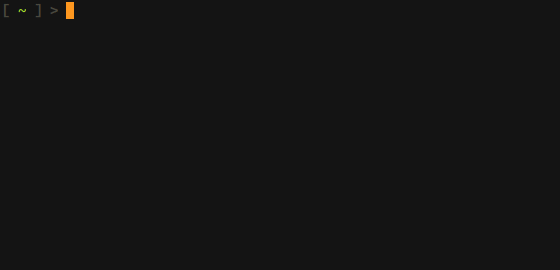

# highlight-pointer

Highlight mouse pointer/cursor using a dot - useful for presentations,
screen sharing, ...

(Walyand not supported, unfortunately. This is a small x11-only utility)

## Demo



## Features

- Very lightweight, should work on any Linux/Unix system running an X
  server
- Should work with any software capturing/sharing the screen
  regardless if it shows the cursor (like Zoom) or not (like Skype)
- Set color for mouse button released and/or pressed state
- Highlight using a filled or outlined dot
- Auto-hide highlight and/or cursor after a time when not moving and
  re-show when moving again
- Global hotkeys for toggling cursor or highlighter and for toggling
  auto-hiding

## Installation

Download the `highlight-pointer` binary from the [releases
page](https://github.com/swillner/highlight-pointer/releases/latest)
or see below to build yourself.

### Prerequisites

To build `highlight-pointer` you need the X11, Xext, Xfixes, and Xi
libraries. On Debian/Ubuntu, just install these using

```
sudo apt-get install libx11-dev libxext-dev libxfixes-dev libxi-dev
```

### Building

Just build the `highlight-pointer` binary using

```
make
```

## Usage

Just call the `highlight-pointer` binary and include command line
options if you want to change color, size, etc. (see below).

To quit the program press `Ctrl+C` in the terminal where you started
it, or run `killall highlight-pointer`.

### Options

```
Usage:
  highlight-pointer [options]

  -h, --help      show this help message

DISPLAY OPTIONS
  -c, --released-color COLOR  dot color when mouse button released [default: '#d62728']
  -p, --pressed-color COLOR   dot color when mouse button pressed [default: '#1f77b4']
  -o, --outline OUTLINE       line width of outline or 0 for filled dot [default: 0]
  -r, --radius RADIUS         dot radius in pixels [default: 5]
      --opacity OPACITY       window opacity (0.0 - 1.0) [default: 1.0]
      --hide-highlight        start with highlighter hidden
      --show-cursor           start with cursor shown

TIMEOUT OPTIONS
      --auto-hide-cursor      hide cursor when not moving after timeout
      --auto-hide-highlight   hide highlighter when not moving after timeout
  -t, --hide-timeout TIMEOUT  timeout for hiding when idle, in seconds [default: 3]

HOTKEY OPTIONS
      --key-quit KEY                        quit
      --key-toggle-cursor KEY               toggle cursor visibility
      --key-toggle-highlight KEY            toggle highlight visibility
      --key-toggle-auto-hide-cursor KEY     toggle auto-hiding cursor when not moving
      --key-toggle-auto-hide-highlight KEY  toggle auto-hiding highlight when not moving

      Hotkeys are global and can only be used if not set yet by a different process.
      Keys can be given with modifiers
        'S' (shift key), 'C' (ctrl key), 'M' (alt/meta key), 'H' (super/"windows" key)
      delimited by a '-'.
      Keys themselves are parsed by X, so chars like a...z can be set directly,
      special keys are named as in /usr/include/X11/keysymdef.h
      or see, e.g. http://xahlee.info/linux/linux_show_keycode_keysym.html

      Examples: 'H-Left', 'C-S-a'
```
